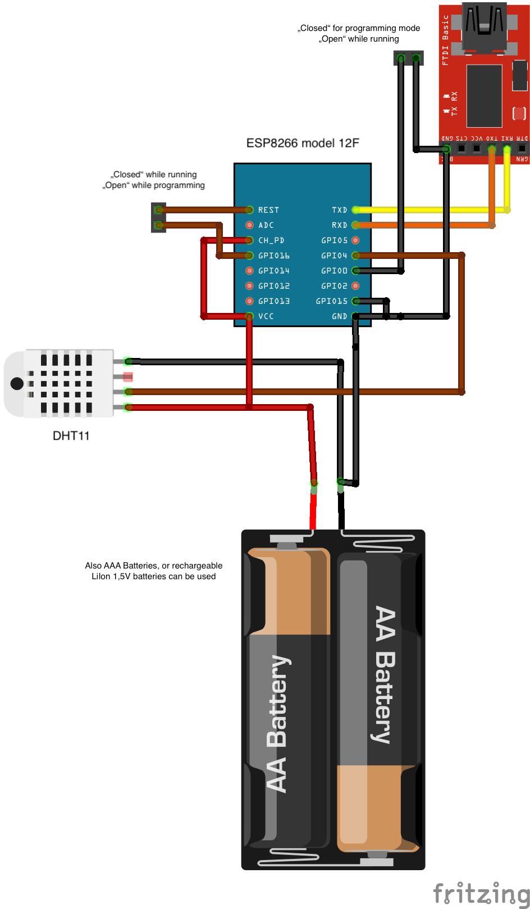
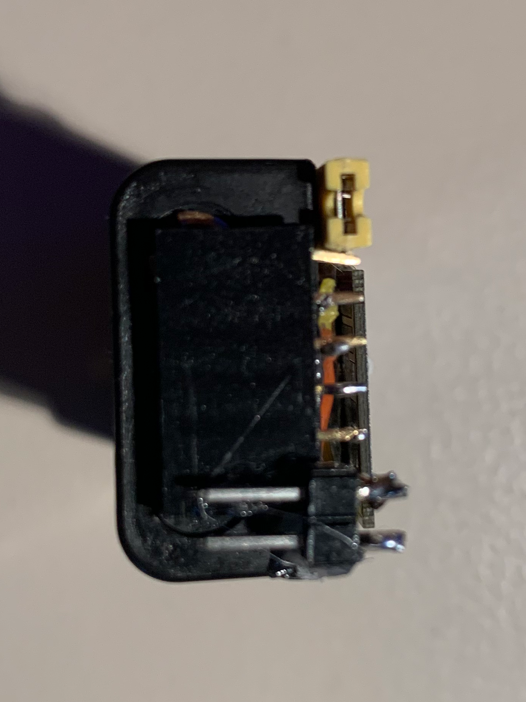

# ESPNowSender
ESPNowSender is used to measure temperature and humidity and send it to the ESPNowLoRaGateway. It also sends the voltage of its own battery to the ESPNowLoRaGateway.

ESPNowSender consists of an ESP8266-12F module and a DHT11 sensor mounted on a battery case for 2 AAA batteries. The batteries are rechargeable 1.5V LiIon batteries. 

To allow programming of the ESP module there are some additional pin connectors. One 6 pin connector for the FTDI232 USB to TTL adapter and two 2 pin connectors to set the module into programming mode.

